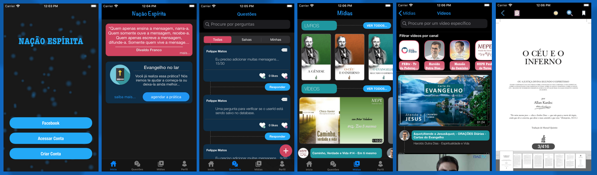

# NacaoEspirita
> [In development] An app for helping people how has get content of Espiritismo.

[![Swift Version][swift-image]][swift-url]
[![License][license-image]][license-url]

The NaçãoEspírita is an app to concentrate doctrinal content for the spiritist community. 
The idea of the app is to apply features present in large apps such as Facebook (feed, posts and comments), Youtube (video execution) and Books (ebook reader).

## Features

- [x] Login integration with Facebook
- [x] Data and authentication with Firebase services
- [x] VIPER design pattern
- [x] Integration with Youtube services
- [x] Used Alamofire for HTTP requests
- [x] E-book reader for specific books
- [x] Player for specific videos
- [x] Schedule to "Pray at home"
- [x] Question and answer system

## Requirements

- iOS 12.0+
- Xcode 11.4

## Setup

Run pod install
Run open NacaoEspirita.xcworkspace

## Meta

Felippe Matos – felippe.matos@hotmail.com - (https://www.linkedin.com/in/felippematos-nt)

Distributed under the XYZ license. See ``LICENSE`` for more information.

[https://github.com/FelippeMatos/NacaoEspirita](https://github.com/dbader/)

[swift-image]:https://img.shields.io/badge/swift-3.0-orange.svg
[swift-url]: https://swift.org/
[license-image]: https://img.shields.io/badge/License-MIT-blue.svg
[license-url]: LICENSE
